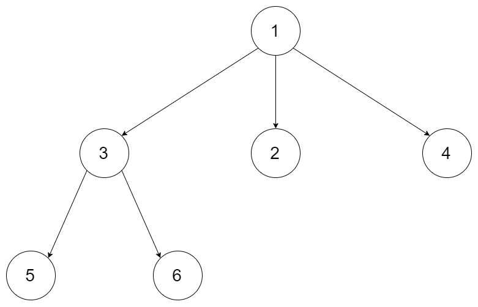

# LC-559 - Maximum Depth of N-ary Tree

Given a n-ary tree, find its maximum depth.

The maximum depth is the number of nodes along the longest path from the root node down to the farthest leaf node.

> * Difficulty: **EASY**

---
## Examples


```
Input:
{"$id":"1","children":[{"$id":"2","children":[{"$id":"5","children":[],"val":5},{"$id":"6","children":[],"val":6}],"val":3},{"$id":"3","children":[],"val":2},{"$id":"4","children":[],"val":4}],"val":1}
Output: 3
```

---
## Notes

* The depth of the tree is at most `1000`.
* The total number of nodes is at most `5000`.

---
## Solutions

1. DFS in Recursion
    * Time complexity: $O(n)$
    * Space complexity: $O(n)$
2. BFS in Iteration
    * Time complexity: $O(n)$
    * Space complexity: $O(n)$